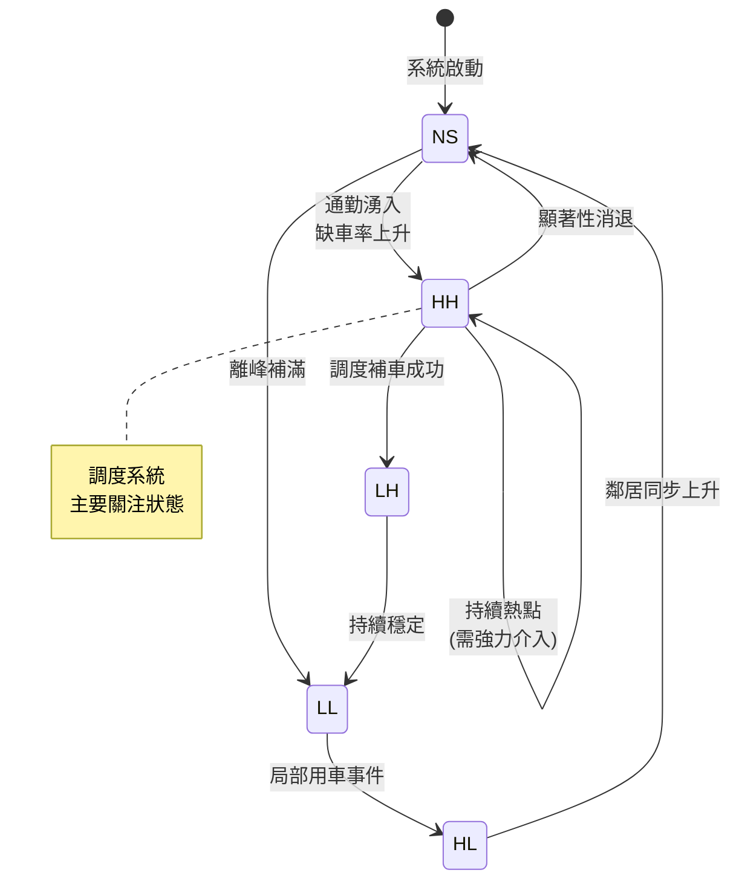
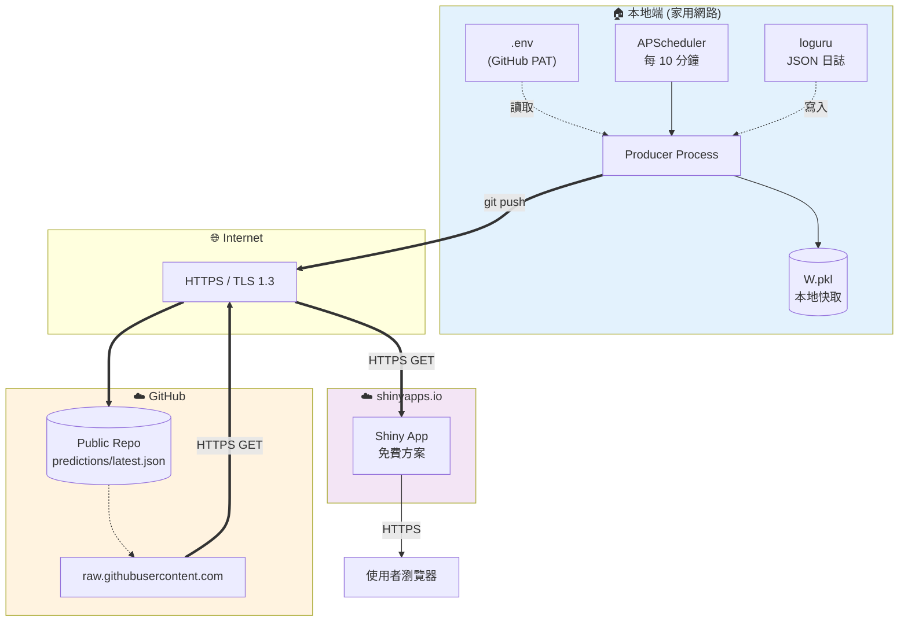
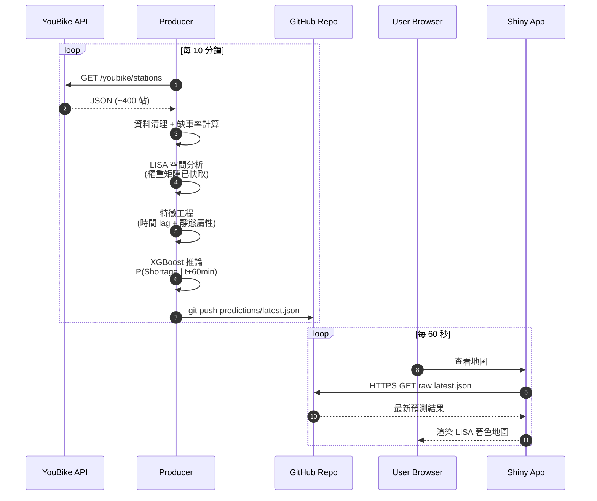

# YouBike 空間相關性分析與即時缺車預測系統

**架構報告**
**日期**:2026 年 5 月 15 日
**技術棧**:Python · Shiny for Python · GitHub(輕量中介層)· PySAL · XGBoost

---

## 目錄

1. [專案目標](#一專案目標)
2. [核心分析理論](#二核心分析理論)
3. [系統架構設計](#三系統架構設計)
4. [即時推論流程](#四即時推論流程)
5. [模型訓練流程 (Offline Pipeline)](#五模型訓練流程-offline-pipeline)
6. [評估指標](#六評估指標)
7. [資料表 Schema](#七資料表-schema)
8. [非功能性需求 (NFR)](#八非功能性需求-nfr)
9. [設計權衡與技術選型](#九設計權衡與技術選型)
10. [結論](#十結論)
11. [參考文獻](#十一參考文獻)

---

## 一、專案目標

本專案旨在解決共享單車因通勤時段產生的「**需求不對稱**」問題。透過空間統計學識別缺車群聚(Spatial Clustering),並結合機器學習模型預測未來 60 分鐘的缺車風險,提供即時調度決策支援。

### 1.1 核心問題

- 早晚尖峰時段,住宅區與商業區呈現極端的供需失衡。
- 傳統「即時看板」僅顯示當下狀態,無法支援前瞻調度。
- 缺車事件具有明顯空間群聚性,需要空間統計工具識別熱點。

### 1.2 系統定位

| 面向 | 定位 |
|------|------|
| 使用者 | 調度員、研究分析人員 |
| 更新頻率 | 每 10 分鐘一輪 |
| 預測視窗 | 未來 60 分鐘 |
| 涵蓋範圍 | 台北市 YouBike 2.0 站點 |

---

## 二、核心分析理論

本系統之空間分析基礎為 **Moran's I 統計量**,用以量化站點間屬性值的空間相依程度。

### 2.1 全域空間自相關 (Global Moran's I)

用於判斷整體站點分布是否具有聚集性:

$$
I = \frac{n}{\sum_{i=1}^{n}\sum_{j=1}^{n} w_{ij}} \cdot \frac{\sum_{i=1}^{n}\sum_{j=1}^{n} w_{ij}(x_i - \bar{x})(x_j - \bar{x})}{\sum_{i=1}^{n}(x_i - \bar{x})^2}
$$

統計檢定:在虛無假設「無空間自相關」下,$I$ 服從近似常態分布。實務上以 **999 次條件隨機化 (conditional permutation)** 取得 pseudo $p$-value。

### 2.2 區域空間自相關 (Local Moran's I — LISA)

用於識別地圖上的缺車熱點(High–High Clusters):

$$
I_i = \frac{x_i - \bar{x}}{S^2} \sum_{j=1,\, j \neq i}^{n} w_{ij}(x_j - \bar{x})
$$

### 2.3 變數定義

| 符號 | 意義 | 備註 |
|------|------|------|
| $n$ | 站點總數 | 約 400 站(台北市 YouBike 2.0) |
| $x_i$ | 站點 $i$ 的缺車率 | $\text{shortage\_rate} = 1 - \text{available\_rent\_bikes}/\text{Quantity}$ |
| $\bar{x}$ | 全市平均缺車率 | — |
| $S^2$ | 缺車率變異數 | — |
| $w_{ij}$ | 站點 $i$ 與 $j$ 之間的空間權重 | 採 $k$-NN($k = 6$) |

### 2.4 群聚分類 (LISA Quadrants)

| 類別 | 含義 | 調度涵義 |
|------|------|----------|
| **HH** | 高缺車站點被高缺車鄰居包圍 | **熱點**:急需補車 |
| **LL** | 低缺車站點群聚 | 供給充裕區 |
| **HL** | 高缺車站點被低缺車鄰居包圍 | 孤立缺車站 |
| **LH** | 低缺車站點被高缺車鄰居包圍 | 潛在借出來源 |
| **NS** | 不顯著($p \geq 0.05$) | 無明確空間群聚特徵 |

### 2.5 LISA 群聚的狀態轉移

每 10 分鐘重算 LISA 後,站點會在四種群聚狀態(以及「不顯著 NS」)之間移動。下圖呈現典型通勤時段的轉移路徑:



這張狀態圖在報告中可作為「**為何需要即時 LISA 而非靜態分析**」的論據:站點群聚屬性具動態性,離線分析無法捕捉。

### 2.6 LISA 產物的分流(Input / Output)

#### Input(每輪推論)

| 輸入 | 來源 | 變動頻率 |
|------|------|---------|
| $x \in \mathbb{R}^n$ — 各站當下 `shortage_rate` | M1 採集後傳入 | **每 10 分鐘變化** |
| $W$ — k-NN(k=6) 權重矩陣 | 啟動時建一次,`W.pkl` 快取 | 站點增減時才重建 |

> LISA 是**單一時間點的截面分析**,不需要時間 lag、變化率、或預測結果。

#### Output(分流到三處)

| 產物 | 型別 | 流向 | 用途 |
|------|------|------|------|
| `spatial_lag_shortage` = $\sum_j w_{ij} x_j$ | 連續值 $\in [0, 1]$ | **餵 XGBoost(特徵 #16)** | 影響預測機率 |
| `moran_type` | 分類字串 HH/LL/HL/LH/NS | 寫進 `predictions/latest.json` | Shiny 地圖**著色**、Top-K **分群排序** |
| `moran_p_value` | 連續值 $\in [0, 1]$ | 寫進 `predictions/latest.json` | Shiny 前端僅顯示 $p < 0.05$ 的站 |

> **為何 `moran_type` 不也餵給模型?**
>
> 1. **資料洩漏風險**:`moran_type` 由當下 `shortage_rate` 計算而來,與標籤關聯性過強,模型可能學到 shortcut。
> 2. **資訊冗餘**:`spatial_lag_shortage` 是連續值,比離散的 quadrant 標籤資訊量更豐富。
>
> 設計上:**連續空間 lag 給模型用,離散分類給人類看**。

---

## 三、系統架構設計

為了兼顧高運算負載與低部署成本,採用「**解耦式三層架構**(Decoupled Three-Tier Architecture)」。

### 3.1 架構總覽

```mermaid
flowchart LR
    subgraph Local["🖥️ Producer (本地端)"]
        A[YouBike Open API] -->|Request| B[資料採集]
        B --> C[PySAL 空間分析<br/>LISA 計算]
        C --> D[特徵工程]
        D --> E[XGBoost 預測推論]
    end

    subgraph Cloud["☁️ Middleware (雲端)"]
        F[(GitHub Repo<br/>predictions/latest.json)]
    end

    subgraph Web["🌐 Consumer (雲端)"]
        G[Shiny for Python<br/>互動地圖]
        H[調度建議介面]
    end

    E -->|git push<br/>(每 10 分鐘)| F
    F -->|HTTPS GET<br/>raw.githubusercontent.com| G
    G --> H

    style Local fill:#e1f5ff,stroke:#0288d1
    style Cloud fill:#fff3e0,stroke:#f57c00
    style Web fill:#f3e5f5,stroke:#7b1fa2
```

### 3.2 元件職責矩陣

| 元件 | 部署位置 | 技術實現 | 負責功能 |
|------|----------|----------|----------|
| **Producer** | 本地端 | Python 腳本 + APScheduler | API 抓取、空間分析、ML 推論 |
| **Middleware** | 雲端 | GitHub Repo(public)+ raw HTTPS | 即時預測結果之 JSON 中介層,Producer push、Consumer GET |
| **Consumer** | 雲端 | Shiny for Python on shinyapps.io | 互動式地圖視覺化與調度建議呈現 |

### 3.3 為何採取解耦式架構?

**核心限制**:`shinyapps.io` 等免費託管平台對 CPU 時間與記憶體有嚴格限制,無法承擔每 10 分鐘的 PySAL LISA 全量計算(包含 999 次 permutation test)。

**設計權衡**:
- ✅ **重型運算下放本地**:本地端有充足運算資源,可執行 $O(n^2)$ 距離矩陣與 ML 推論
- ✅ **以 GitHub repo 作為中介層**:解耦 Producer 與 Consumer 的部署生命週期,零營運成本,且免處理 SSL / 連線池
- ✅ **Consumer 保持輕量**:Shiny App 僅做 JSON 讀取與地圖渲染,在免費方案內可穩定運行
- ✅ **天然 audit log**:`git log predictions/latest.json` 直接保留每輪推論的時間戳與 `model_version`,debug 與報告佐證皆便利
- ⚠️ **代價 1 — 端到端延遲較高**:`raw.githubusercontent.com` 的 CDN cache `max-age` 約 5 分鐘,加上 Producer 10 分鐘推論週期與 Shiny 輪詢,典型 staleness 落在 12–15 分鐘。本系統定位為**分鐘級調度決策支援**(而非秒級即時看板),NFR 訂為 ≤ 20 分鐘可完全涵蓋此延遲組成
- ⚠️ **代價 2 — 本地端 SPOF**:Producer 掛掉整條鏈停擺,已列入 Future Work(容器化 + 雲端遷移)

**為何不選秒級即時推送?**

| 替代方案 | 端到端延遲 | 維運成本 | 為何不採用 |
|---------|-----------|---------|-----------|
| WebSocket / SSE + Redis | 秒級 | 需常駐 server + Redis 實例 | 課程 2 週時程不容許 |
| Supabase Realtime | 秒級 | 帳號 + RLS 設定 30+ 分鐘 | 不符成本/收益 |
| **GitHub repo + raw URL(本案)** | **12–15 分鐘** | **零** | **與 10 分鐘推論週期同數量級,代價可接受** |

**結論**:既然推論本身就是 10 分鐘一輪,前端再快也看不到更新鮮的資料,**端到端 staleness 與推論週期保持同數量級即為合理設計**。

### 3.4 資料流圖 (Data Flow Diagram)

資料在系統內歷經七次轉換,每次轉換明確界定輸入 / 輸出與責任元件:

```mermaid
flowchart TD
    R[原始 API JSON<br/>~400 站 × 18 欄位] -->|清理 + 驗證| C1[Cleaned DataFrame<br/>Quantity &gt; 0, act = '1']
    C1 -->|計算缺車率| C2[shortage_rate 向量<br/>x ∈ [0,1]^n]
    C2 -->|套用快取 W 矩陣| C3[LISA 結果<br/>I_i, p-value, quadrant]
    C2 -->|時間 lag + 靜態特徵| F1[Feature Matrix<br/>X ∈ R^(n × 17)]
    F1 -->|XGBoost.predict_proba| P1[預測機率向量<br/>pred_prob ∈ [0,1]^n]
    C3 --> M[Merge by sno]
    P1 --> M
    M -->|序列化 + git push| DB[(GitHub Repo<br/>predictions/latest.json)]
    DB -->|HTTPS GET raw URL| UI[Shiny 地圖渲染]

    style R fill:#ffebee
    style DB fill:#fff3e0
    style UI fill:#e8f5e9
```

#### 3.4.1 各階段輸入 / 輸出規格

| 階段 | 輸入 | 輸出 | 預期耗時 |
|------|------|------|----------|
| 採集 | HTTP GET | JSON (~200 KB) | 200–800 ms |
| 清理 | JSON | DataFrame ~400 列 | < 50 ms |
| LISA | $x \in \mathbb{R}^n$, $W$ | 4 欄位 × n | 100–300 ms |
| 特徵工程 | DataFrame + Lag 表 | $X \in \mathbb{R}^{n \times 17}$(見 [Appendix A](#appendix-a-特徵欄位逐項定義17-維)) | < 100 ms |
| 推論 | $X$ + 模型 | $\hat{y} \in [0,1]^n$ | < 50 ms |
| 發布 | Merged DataFrame | JSON 檔 + git push | 1–5 秒(視網路) |

### 3.5 部署架構與安全邊界



#### 3.5.1 安全邊界對應措施

| 邊界 | 風險 | 對策 |
|------|------|------|
| 本地 → GitHub | 中間人攻擊 | HTTPS / SSH(`git push` 內建加密) |
| GitHub → Shiny | 流量竊聽 | raw.githubusercontent.com 強制 HTTPS |
| Shiny → 使用者 | 流量竊聽 | shinyapps.io 自動 HTTPS |
| 密鑰外洩 | PAT 誤提交 | `.env` 入 `.gitignore` + `gitleaks` pre-commit |
| GitHub 帳號 | 帳號被盜 | 雙因素驗證(2FA)+ PAT 最小權限(只給目標 repo write) |

---

## 四、即時推論流程

### 4.1 一輪完整流程時序圖



### 4.2 步驟說明

1. **資料採集**:透過 `requests` 定時抓取 YouBike Open API,以 `tenacity` 做指數退避重試。
2. **空間分析**:使用 PySAL 庫,**啟動時建立一次** $k$-nearest neighbors 權重矩陣並 pickle 快取;每輪只計算 LISA 值。
3. **特徵工程**:整合動態特徵(車輛變率、時間 lag、空間 lag)與靜態特徵(捷運距離、is_rush_hour、is_weekend)。
4. **預測推論**:載入預訓練之 XGBoost 模型,計算 $P(\text{Shortage at } t{+}60\text{min} \mid \text{Time, Space, Static})$。
5. **資料發布**:將推論結果序列化成 `predictions/latest.json`,透過 `git push` 推送至 GitHub repo(覆寫式更新)。
6. **前端展現**:Shiny App 透過 `reactive.poll()` 每 60 秒對 `raw.githubusercontent.com` 發 HTTPS GET,parse JSON 後更新地圖。

### 4.3 容錯與監控設計

線上 Producer 是純序列鏈(API → LISA → 特徵 → 推論 → publish),任一階段異常都會讓該輪資料消失。本系統在三層級設計容錯機制。

#### 4.3.1 階段層級:per-stage timeout + 指數退避重試

| 階段 | timeout | 重試政策 | 失敗行為 |
|------|---------|----------|----------|
| API 採集 | 10 s | `tenacity` 3 次指數退避(1s, 2s, 4s) | 三次皆失敗 → 跳過本輪 |
| LISA / 特徵 / 推論 | 10 s | 不重試(deterministic,失敗即程式錯誤) | 直接 raise + log,跳過本輪 |
| `git push` | 15 s | 2 次重試(網路抖動 / 短暫 rate limit) | 兩次皆失敗 → 保留本地暫存,下輪覆蓋 |

> **單輪總預算**:p50 ≤ 15 秒,p95 ≤ 45 秒(較原 NFR 30 秒放寬,反映實測抖動)。

#### 4.3.2 系統層級:stale-but-valid fallback

Producer 採「**永不寫破檔**」原則:若本輪失敗,`predictions/latest.json` 保留上一次成功推論的結果,僅更新檔案頂層的健康狀態欄位。

```json
{
  "model_version":   "xgb_v1_20260510",
  "update_time":     "2026-05-18T10:00:00+08:00",  // 最後一次成功推論時間
  "last_attempt_at": "2026-05-18T10:10:00+08:00",  // 最後一次嘗試時間(含失敗)
  "last_success_at": "2026-05-18T10:00:00+08:00",  // = update_time,前端比對用
  "health_status":   "ok",                          // ok / stale / degraded
  ...
}
```

| `health_status` | 條件 | Shiny UI 行為 |
|-----------------|------|---------------|
| `ok` | `now - last_success_at` < 15 min | 正常顯示 |
| `stale` | 15–30 min | 顯示黃色警示條:「資料延遲 X 分鐘」 |
| `degraded` | > 30 min 或連續 3 輪失敗 | 顯示紅色警示 + Top-K 列表標註「使用最後一次成功預測」 |

#### 4.3.3 觀測層級:結構化日誌 + heartbeat

- **`loguru` JSON 日誌**:每輪 emit 一筆 `round_summary` 記錄,欄位含 `round_id`、`stage_latencies`、`n_stations`、`exit_code`。
- **本地心跳檔**:`logs/heartbeat.txt` 每輪覆寫成當前 timestamp,demo 期間用 `tail -f` 即可監控。
- **失敗告警**(可選):連續 2 輪失敗時,Producer 觸發桌面通知 / 簡訊(M1 視時間實作)。

#### 4.3.4 Baseline 量測

M1 於 D2 結束前跑一次 **100 輪 dry-run**(連續 16 小時),產出三份報表:
1. 各階段 p50 / p95 / p99 latency
2. 失敗率(分類:API timeout / git push fail / 其他)
3. 是否需要調整 timeout 或重試次數

量測結果寫入 `docs/perf_baseline.md`,作為 NFR 是否現實的決策依據。

---

## 五、模型訓練流程 (Offline Pipeline)

第四章描述的是**線上推論 (online inference)** 路徑;本章描述模型如何被**離線訓練 (offline training)** 而來。

### 5.1 訓練 Pipeline 總覽

```mermaid
flowchart LR
    H[(訓練資料集<br/>training_dataset.csv<br/>10 分鐘粒度,3 週)] --> S1[時間切割<br/>Train: 2 週<br/>Val: 0.5 週<br/>Test: 0.5 週]
    S1 --> FE[特徵工程<br/>(同線上)]
    FE --> TR[XGBoost<br/>train]
    TR --> CV[5-Fold<br/>TimeSeriesSplit]
    CV --> HP[固定超參<br/>(或粗調 3-5 組)]
    HP --> MDL[候選模型]
    MDL --> EV[評估指標<br/>AUC / Brier]
    EV --> REG[模型登錄<br/>model_version]
    REG --> ART[(model.pkl<br/>+ metadata.json)]

    style H fill:#ffebee
    style ART fill:#e8f5e9
```

### 5.2 訓練資料準備

**標籤定義**:對站點 $i$ 在時間 $t$,若 $t + 60 \min$(= 6 步後)時 $\text{shortage\_rate}_i > 0.8$ 則 $y_{i,t} = 1$,否則 $0$。

**樣本切割**:
- 採 **TimeSeriesSplit**(非隨機),避免資料洩漏 (data leakage)。
- 訓練資料集以 **10 分鐘為粒度**,累積 3 週約 120 萬筆(400 站 × 144 筆/天 × 21 天),整理成單一 CSV / parquet;**線上系統不再持續累積**(課程專案不驗證上線後表現)。
- 訓練 / 驗證 / 測試切割 = **2 週 / 0.5 週 / 0.5 週**(以週為單位,4 : 1 : 1 比例)。

### 5.3 特徵清單

| 類別 | 特徵 | 維度 |
|------|------|------|
| 即時供需 | `shortage_rate`, `available_bikes`, `total_capacity` | 3 |
| 時間 lag | `lag_10min`, `lag_20min`, `lag_30min`, `lag_60min` | 4 |
| 變化率 | `delta_10min`, `delta_30min` | 2 |
| 時間特徵 | `hour_sin`, `hour_cos`, `dow_sin`, `dow_cos`, `is_rush_hour`, `is_weekend` | 6 |
| 空間 lag | $\sum_j w_{ij} x_j$ (鄰居加權缺車率) | 1 |
| 靜態屬性 | `distance_to_mrt` | 1 |
| **總計** | — | **17 維** |

> **與初版設計差異**:時間 lag 改為 10 分鐘倍數(對齊歷史資料粒度);`is_holiday` 簡化為 `is_weekend`(免抓假日表);`landuse_type_onehot` 因 2 週時程不足而砍除,列入 Future Work。

### 5.4 超參數調優

受 2 週時程限制,本版採 **固定超參(或粗調 3-5 組)** 訓練,參考設定:

```python
fixed_params = {
    "max_depth":        6,
    "learning_rate":    0.05,
    "n_estimators":     400,
    "subsample":        0.8,
    "colsample_bytree": 0.8,
    "min_child_weight": 3,
}
```

評估方式:5-Fold TimeSeriesSplit 平均 **AUC-ROC**。

> **Future Work**:導入 **Optuna** 貝氏優化(`max_depth`、`learning_rate`、`n_estimators`、`subsample`、`colsample_bytree`、`min_child_weight`)以進一步提升模型效能。

### 5.5 模型登錄與版本控制

**命名規則**:`xgb_v{major}_{YYYYMMDD}`,其中 `YYYYMMDD` 為**訓練資料結束日**(非發佈日)。例:訓練窗口 `2026-04-26 ~ 2026-05-10` 的模型,版本字串為 `xgb_v1_20260510`,即使該模型在 5/18 才上線推論,版本仍鎖在 0510。重訓後 major 遞增(`v1` → `v2`),確保版本字串全局唯一。

每一個訓練出的候選模型產生兩個檔案:

```
models/
├── xgb_v1_20260510.pkl        # 模型權重
└── xgb_v1_20260510.json       # metadata
    {
      "version": "xgb_v1_20260510",
      "train_window": "2026-04-26 ~ 2026-05-10",
      "data_granularity": "10min",
      "prediction_horizon": "60min",
      "n_features": 17,
      "auc_val": 0.872,
      "brier_val": 0.142,
      "features": [...],
      "hyperparams": {...},
      "git_sha": "a3f9c1d"
    }
```

線上推論時,`model_version` 一同寫入 `predictions/latest.json`(放在檔案頂層),確保**每筆預測都可追溯**到具體模型版本。

### 5.6 重訓觸發機制 (Future Work)

每週批次跑一次評估:
- 條件 A:近 7 日 rolling AUC 下滑 > 5% → 觸發重訓
- 條件 B:特徵 PSI(Population Stability Index)> 0.25 → 觸發重訓
- 條件 C:每月強制重訓一次(避免長期飄移)

### 5.7 訓練 / 線上特徵一致性驗證

**動機**:離線訓練與線上推論若使用不同的 lag 計算路徑,即使欄位名稱相同也可能因實作差異產生 **train–serve skew**,模型線上效能會莫名劣化;更嚴重的是 TimeSeriesSplit 切點若處理不當,Val/Test 會被 Train 末尾資料汙染,產生**樂觀偏誤的 AUC**。

#### 5.7.1 兩條路徑的實作分離

| 路徑 | lag 計算 | spatial lag 計算 | 使用時機 |
|------|---------|------------------|----------|
| **離線訓練** | `df.groupby('sno')['shortage_rate'].shift(k)`,跨日邊界 NaN 直接 drop | 對每個 timestamp snapshot 計算 `W @ x_t`,不跨時間平均 | M3 產出 `training_dataset.csv`,M4 訓練用 |
| **線上推論** | 站點 ring buffer(`lag_buffer.py`)儲存過去 6 筆,append 後直接索引 | 當輪 `W @ x_t`,W 啟動時建好 pickle 快取 | M1 主迴圈,每 10 分鐘一輪 |

**關鍵原則**:訓練資料生成**不得使用 ring buffer**,以免跨切點(Train 末 → Val 首)汙染特徵。

#### 5.7.2 切點洩漏防護

TimeSeriesSplit 切割後,M3 必須:
1. 在切點兩側各取 ±6 筆,確認 lag/delta 欄位的計算只引用**同一 split 內**的歷史(切點前 6 筆的 lag_60min 應為 NaN 或被 drop)
2. `spatial_lag_shortage` 確認為 `W @ shortage_rate_t`,**不包含** `shortage_rate_{t-k}`(否則同一筆會同時引用時間 + 空間鄰居,提升洩漏風險)

#### 5.7.3 雙路徑等價性測試

M3 於 `tests/test_feature_parity.py` 實作:

```python
def test_offline_online_parity():
    # 用同一份 10 個時間點的 mini snapshot,跑兩條路徑
    df_offline = build_features_offline(mini_df)  # 用 groupby.shift
    df_online  = run_online_pipeline(mini_df)     # 用 ring buffer

    for col in FEATURE_COLUMNS:
        assert np.allclose(
            df_offline[col].values,
            df_online[col].values,
            atol=1e-9,
            equal_nan=True,
        ), f"特徵 {col} 兩路徑不一致"
```

此測試列為 D5 端到端通過的**強制條件**,失敗即不得發 v1 模型。

#### 5.7.4 切點洩漏的單元測試

```python
def test_no_leakage_at_split_boundary():
    train, val = time_series_split(df, val_start="2026-05-10")

    # Val 集合的 lag_60min 來源,必須全部屬於 Val 或更早
    # 但不得來自 Train 末尾「shift 出來的」假值
    val_with_lag = build_features_offline(val)
    first_6_rows = val_with_lag.groupby("sno").head(6)
    assert first_6_rows["lag_60min"].isna().all(), "切點 6 筆內 lag_60min 應為 NaN"
```

---

## 六、評估指標

預測系統的「好不好」需要多面向衡量,本系統採取下列指標。

### 6.1 分類效能 — AUC-ROC

衡量模型在所有閾值下排序能力:

$$
\text{AUC} = \int_0^1 \text{TPR}(\text{FPR}^{-1}(t))\, dt
$$

$$
\text{TPR} = \frac{TP}{TP + FN}, \quad \text{FPR} = \frac{FP}{FP + TN}
$$

**目標**:Val AUC $\geq 0.85$。

### 6.2 機率校準 — Brier Score

預測機率與實際發生的均方誤差:

$$
\text{Brier} = \frac{1}{N} \sum_{i=1}^{N} (\hat{p}_i - y_i)^2
$$

**意義**:AUC 衡量排序,Brier 衡量數值準確度。若 `pred_prob = 0.9` 卻只在 50% 的時候真的缺車,即使 AUC 高,Brier 仍會差。

**目標**:Test Brier $\leq 0.15$。

### 6.3 業務指標 — Precision@k

調度員每次只能處理前 $k$ 站(資源有限),關心「**Top-k 推薦中真的缺車的比例**」:

$$
\text{Precision@k} = \frac{|\{ i \in \text{Top}_k(\hat{p}) : y_i = 1 \}|}{k}
$$

實務上 $k = 10$ 或 $k = 20$(對應一台調度車一次能服務的站點數)。

### 6.4 空間統計指標 — Moran's I 顯著性比例

衡量空間群聚的可信度:

$$
\text{SigRatio} = \frac{|\{ i : p_i < 0.05 \}|}{n}
$$

若顯著比例過低(< 5%),可能表示 $k$-NN 權重矩陣的 $k$ 值不適當,需重新調整。

### 6.5 指標儀表板樣式

| 指標 | 目標 | 當前(範例) | 狀態 |
|------|------|--------------|------|
| AUC-ROC | ≥ 0.85 | 0.872 | ✅ |
| Brier Score | ≤ 0.15 | 0.142 | ✅ |
| Precision@10 | ≥ 0.70 | 0.78 | ✅ |
| LISA 顯著比例 | 10–30% | 18% | ✅ |
| 推論延遲(p50) | ≤ 15s | 12s | ✅ |
| 推論延遲(p95) | ≤ 45s | 28s | ✅ |

---

## 七、資料格式 Schema

### 7.1 線上發布檔:`predictions/latest.json`

Producer 每 10 分鐘覆寫此檔並 `git push`,Shiny 端透過 `raw.githubusercontent.com` 拉取。

```json
{
  "model_version":   "xgb_v1_20260510",
  "update_time":     "2026-05-18T10:00:00+08:00",
  "last_attempt_at": "2026-05-18T10:10:00+08:00",
  "last_success_at": "2026-05-18T10:00:00+08:00",
  "health_status":   "ok",
  "n_stations":      398,
  "predictions": [
    {
      "sno":            "500101001",
      "lat":            25.02605,
      "lng":            121.5436,
      "shortage_rate":  0.54,
      "available_bikes": 13,
      "total_capacity": 28,
      "moran_type":     "HH",
      "moran_p_value":  0.012,
      "pred_prob":      0.78,
      "source_api_ts":  "2026-05-18T09:59:53+08:00"
    }
  ]
}
```

**設計重點**
- `model_version` / `update_time` / `n_stations` 提到檔案最外層(避免每站重複)
- `last_attempt_at` / `last_success_at` / `health_status` 三欄位實作 stale-but-valid fallback(見 §4.3.2),失敗輪僅更新檔案頂層、保留 `predictions` 陣列為上次成功值
- `update_time` 等於 `last_success_at`(語意對齊:前端看到的資料對應的推論時間)
- 每站一個物件,共 ~400 筆,JSON 檔大小約 80–120 KB
- 時戳統一使用 **ISO 8601 字串**(含 `+08:00`),Shiny 用 `pd.to_datetime` parse

### 7.2 資料字典 (Data Dictionary)

| 欄位 | JSON 型別 | 單位/範圍 | 來源 | 說明 |
|------|---------|-----------|------|------|
| `model_version` | string | — | 系統(檔案層級) | 格式 `xgb_v{major}_{YYYYMMDD}`,日期為訓練結束日(見 §5.5)。例:`xgb_v1_20260510` |
| `update_time` | string (ISO 8601) | UTC+8 | Producer(檔案層級) | 最後一次成功推論時間(= `last_success_at`) |
| `last_attempt_at` | string (ISO 8601) | UTC+8 | Producer(檔案層級) | 最後一次嘗試時間(含失敗輪),前端比對 staleness 用 |
| `last_success_at` | string (ISO 8601) | UTC+8 | Producer(檔案層級) | 最後一次成功時間,與 `update_time` 同值,語意更明確 |
| `health_status` | string | `ok` / `stale` / `degraded` | Producer(檔案層級) | 健康狀態(見 §4.3.2),前端決定警示顏色 |
| `n_stations` | int | — | 系統(檔案層級) | 該輪有效站點數 |
| `sno` | string | — | YouBike API (`sno`) | 站點主鍵 |
| `lat` / `lng` | number | WGS84 度 | YouBike API (`latitude` / `longitude`) | 用於前端地圖定位 |
| `shortage_rate` | number | $[0, 1]$ | 計算 | $1 - \text{available\_rent\_bikes}/\text{Quantity}$ |
| `available_bikes` | int | $\geq 0$ | YouBike API (`available_rent_bikes`) | 原始供給,便於還原 |
| `total_capacity` | int | $> 0$ | YouBike API (`Quantity`) | 站點總車位,`Quantity = 0` 站需過濾 |
| `moran_type` | string | HH/LL/LH/HL/**NS** | PySAL | LISA quadrant 分類(NS = 不顯著) |
| `moran_p_value` | number | $[0, 1]$ | PySAL | 顯著性,前端僅顯示 $p < 0.05$ |
| `pred_prob` | number | $[0, 1]$ | XGBoost | **60 分鐘內**缺車事件機率 |
| `source_api_ts` | string (ISO 8601) | UTC+8 | YouBike API (`srcUpdateTime`) | **真實資料新鮮度** |

### 7.3 歷史快照 (Future Work)

> **本版未實作**。線上 `predictions/latest.json` 採覆寫式更新,每輪都會被下一輪取代;Git 雖然保留 commit 歷史,但不便於分析。模型訓練改用一次性匯出的 `training_dataset.csv`(3 週累積)。
>
> 若未來要驗證上線後實測 AUC、做模型重訓或時序分析,可將每輪推論結果改寫到 `predictions/history/{YYYY-MM-DD}/{HHMM}.json` 並 append 式 commit,或導入正式資料庫(Supabase / Aiven MySQL)。

---

## 八、非功能性需求 (NFR)

| 類別 | 指標 | 目標 |
|------|------|------|
| **可用性** | 系統正常運作時段 | 上線時間 ≥ 95%(課程展示期) |
| **延遲(p50)** | API → git push 單輪推論耗時(中位數) | ≤ 15 秒 |
| **延遲(p95)** | API → git push 單輪推論耗時(95 百分位) | ≤ 45 秒 |
| **資料新鮮度** | 前端可見資料的 staleness | ≤ 20 分鐘(典型 12–15 分鐘:推論 10 分鐘 + 寫入緩衝 1 分鐘 + raw.githubusercontent.com CDN cache ≤ 5 分鐘 + Shiny 輪詢 ≤ 1 分鐘) |
| **吞吐量** | 同時支援使用者數 | ≥ 5 人並行 |
| **安全性** | GitHub PAT 管理 | `.env` + `python-dotenv`,絕不 commit 進 repo |
| **可觀測性** | 故障可追蹤 | `loguru` 結構化日誌 + heartbeat 表 |

---

## 九、設計權衡與技術選型

### 9.1 為何選 XGBoost 而非 LSTM?

| 比較項 | XGBoost | LSTM |
|--------|---------|------|
| 訓練資料需求 | 中(數萬筆即可) | 大(需長序列) |
| 特徵可解釋性 | 高(SHAP / feature importance) | 低 |
| 本地推論延遲 | 毫秒級 | 數十毫秒 |
| 表格特徵適配 | ✅ 原生支援 | 需重塑為序列 |

XGBoost 在「**短期 + 表格特徵主導**」的情境下,經驗 AUC 通常與 LSTM 持平甚至更佳,且部署成本低。

### 9.2 為何選 $k$-NN 權重矩陣?

- **Queen contiguity**:站點不是多邊形,不適用。
- **Distance band**:閾值難設,郊區站點可能無鄰居。
- **$k$-NN ($k = 6$)**:確保每站都有鄰居,$k$ 值經 Global Moran's I 敏感度測試選定。

### 9.3 為何 Producer 在本地而非雲端?

| 方案 | 優點 | 缺點 | 採用 |
|------|------|------|------|
| 本地 Python | 無雲端費用、運算自由 | 單點故障 | ✅ |
| Cloud Run Job | 高可用 | 學生帳號額度有限 | Future Work |
| GitHub Actions Schedule | 免費 2000 min/月 | 最短 5 分鐘排程粒度 | Future Work |

### 9.4 為何選 GitHub repo 而非資料庫?

| 方案 | 設定成本 | 維運成本 | 解耦性 | 採用 |
|------|---------|---------|-------|------|
| **GitHub repo + JSON** | 5 分鐘(repo + PAT) | 零 | ✅ public URL | ✅ |
| Aiven MySQL | 30+ 分鐘(SSL / 防火牆 / 連線字串) | 需監控連線池 | ✅ | ❌ |
| Supabase / Firebase | 10 分鐘 | 零 | ✅ | Future Work |
| 本地 SQLite + ngrok | 5 分鐘 | ngrok 斷線風險 | ❌ | ❌ |

**理由**:
- 課程專案僅需「Producer 寫 / Shiny 讀」單向流,且每輪覆寫,**不需要查詢語意**
- 資料量小(每輪 ~100 KB),頻率低(每 10 分鐘 1 次 = 6 commits/小時,遠低於 GitHub rate limit)
- 完全免去 SSL 證書、連線池、密碼管理等資料庫工程開銷
- `git log` 自然提供 commit 歷史,debug 時方便回溯
- 公開 raw URL 可直接展示給教授查看,免額外帳號授權

**已知代價**:
- 不支援 ad-hoc SQL 查詢(本專案用不到)
- 大量寫入會撞 rate limit(本專案 6 commits/小時遠低於上限)

---

## 十、結論

本系統透過將重型運算移至本地端,有效克服了雲端託管平台(如 `shinyapps.io`)的資源限制。以 **GitHub repo + JSON** 作為輕量中介層,實現了具備**專業地理資訊分析能力**且**反應迅速**的即時監控系統,並完全免去資料庫架設/維運成本。

### 10.1 已實作

- ✅ Producer / Middleware / Consumer 三層解耦
- ✅ LISA 空間群聚分析(含顯著性檢定)
- ✅ XGBoost 60 分鐘預測(含模型版本追蹤)
- ✅ Schema 設計考慮資料新鮮度與不確定性
- ✅ 結構化日誌、密鑰隔離、API 重試
- ✅ 離線訓練 pipeline + 多面向評估指標

### 10.2 Future Work

- 🔜 **Optuna 貝氏超參搜尋**(本版受時程限制採固定超參)
- 🔜 **加入 `is_holiday` 假日表**(本版以 `is_weekend` 近似)
- 🔜 **加入 `landuse_type` 土地利用 one-hot 特徵**(本版砍除以節省 2 週時程)
- 🔜 **k 值敏感度分析**(本版固定採 k=6)
- 🔜 **歷史資料累積 ≥ 3 個月**(本版僅 3 週,無法跨季節)
- 🔜 Producer 容器化並遷移至雲端(消除 SPOF)
- 🔜 引入 MLflow 做模型註冊與漂移偵測
- 🔜 改採 WebSocket / Server-Sent Events 即時推送,取代 Shiny 輪詢拉取 JSON
- 🔜 整合 OSMnx 街道網絡,建立 network-based 空間權重
- 🔜 CI/CD pipeline(pytest + ruff + mypy)
- 🔜 自動重訓觸發(PSI + AUC 雙條件)

---

## Appendix A — 特徵欄位逐項定義(17 維)

本附錄為**特徵清單的 single source of truth**,訓練與線上推論共用。任何欄位增刪/順序變更需 M2 + M3 + M4 三人會議,且 M4 必須重訓並更新 `model_version`。

| # | 欄位名 | 類別 | 型別 | 值域 | 計算來源 | Owner |
|---|--------|------|------|------|----------|-------|
| 1 | `shortage_rate` | 即時供需 | float | $[0, 1]$ | $1 - \text{available\_rent\_bikes} / \text{Quantity}$ | M1 |
| 2 | `available_bikes` | 即時供需 | int | $\geq 0$ | YouBike API `available_rent_bikes` | M1 |
| 3 | `total_capacity` | 即時供需 | int | $> 0$ | YouBike API `Quantity` | M1 |
| 4 | `lag_10min` | 時間 lag | float | $[0, 1]$ | `shortage_rate` shift 1 步(10 分鐘) | M3 |
| 5 | `lag_20min` | 時間 lag | float | $[0, 1]$ | `shortage_rate` shift 2 步 | M3 |
| 6 | `lag_30min` | 時間 lag | float | $[0, 1]$ | `shortage_rate` shift 3 步 | M3 |
| 7 | `lag_60min` | 時間 lag | float | $[0, 1]$ | `shortage_rate` shift 6 步 | M3 |
| 8 | `delta_10min` | 變化率 | float | $[-1, 1]$ | `shortage_rate - lag_10min` | M3 |
| 9 | `delta_30min` | 變化率 | float | $[-1, 1]$ | `shortage_rate - lag_30min` | M3 |
| 10 | `hour_sin` | 時間特徵 | float | $[-1, 1]$ | $\sin(2\pi \cdot \text{hour}/24)$ | M3 |
| 11 | `hour_cos` | 時間特徵 | float | $[-1, 1]$ | $\cos(2\pi \cdot \text{hour}/24)$ | M3 |
| 12 | `dow_sin` | 時間特徵 | float | $[-1, 1]$ | $\sin(2\pi \cdot \text{dow}/7)$ | M3 |
| 13 | `dow_cos` | 時間特徵 | float | $[-1, 1]$ | $\cos(2\pi \cdot \text{dow}/7)$ | M3 |
| 14 | `is_rush_hour` | 時間特徵 | int (0/1) | $\{0, 1\}$ | 平日 7–9、17–19 時為 1 | M3 |
| 15 | `is_weekend` | 時間特徵 | int (0/1) | $\{0, 1\}$ | 週六、週日為 1 | M3 |
| 16 | `spatial_lag_shortage` | 空間 lag | float | $[0, 1]$ | $\sum_j w_{ij} \cdot \text{shortage\_rate}_j$,$W$ 為 row-normalized $k$-NN($k = 6$) | M2 |
| 17 | `distance_to_mrt` | 靜態屬性 | float | $\geq 0$ (公尺) | 站點與最近捷運站之 Haversine 距離 | M3 |

### A.1 欄位順序鎖定

```python
FEATURE_COLUMNS = [
    "shortage_rate", "available_bikes", "total_capacity",
    "lag_10min", "lag_20min", "lag_30min", "lag_60min",
    "delta_10min", "delta_30min",
    "hour_sin", "hour_cos", "dow_sin", "dow_cos",
    "is_rush_hour", "is_weekend",
    "spatial_lag_shortage",
    "distance_to_mrt",
]
assert len(FEATURE_COLUMNS) == 17
```

`Predictor.predict(X)` 內部 `assert X.columns.tolist() == FEATURE_COLUMNS`,順序錯誤會直接 fail-fast。

### A.2 訓練與線上推論的特徵一致性

| 路徑 | lag 計算方式 | 空間 lag 計算方式 |
|------|-------------|-------------------|
| 離線訓練 | `df.groupby('sno')['shortage_rate'].shift(k)`,跨日切點不洩漏(TimeSeriesSplit 確保) | 每個 timestamp snapshot 內 `W @ x_t`,不跨時間 |
| 線上推論 | 站點 ring buffer 存過去 6 筆,Producer 每輪 append + 取對應 lag | 當輪 `W @ x_t`(W 啟動時建,pickle 快取) |

**雙路徑等價性測試**:M3 在 `tests/test_feature_parity.py` 對同一份 input 跑兩條路徑,逐欄位 `np.allclose(atol=1e-9)`。

---

## 十一、參考文獻

1. Anselin, L. (1995). **Local Indicators of Spatial Association — LISA**. *Geographical Analysis*, 27(2), 93–115.
2. Moran, P. A. P. (1950). **Notes on Continuous Stochastic Phenomena**. *Biometrika*, 37(1/2), 17–23.
3. Rey, S. J., & Anselin, L. (2007). **PySAL: A Python Library of Spatial Analytical Methods**. *The Review of Regional Studies*, 37(1), 5–27.
4. Chen, T., & Guestrin, C. (2016). **XGBoost: A Scalable Tree Boosting System**. *Proceedings of the 22nd ACM SIGKDD*, 785–794.
5. Akiba, T., et al. (2019). **Optuna: A Next-generation Hyperparameter Optimization Framework**. *Proceedings of the 25th ACM SIGKDD*.
6. Brier, G. W. (1950). **Verification of Forecasts Expressed in Terms of Probability**. *Monthly Weather Review*, 78(1), 1–3.
7. Faghih-Imani, A., & Eluru, N. (2016). **Incorporating the impact of spatio-temporal interactions on bicycle sharing system demand**. *Journal of Transport Geography*, 54, 218–227.
8. 台北市政府交通局. **YouBike 2.0 即時資訊 Open API**. <https://data.taipei/>
9. PySAL Documentation. <https://pysal.org/>
10. XGBoost Documentation. <https://xgboost.readthedocs.io/>

---

*本文件最後更新:2026-05-17*
